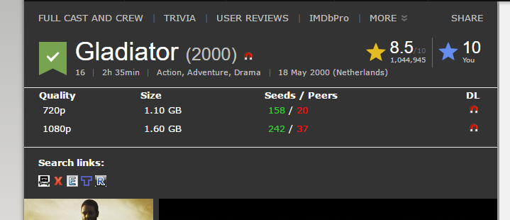

# imdb-torrent-search

## Install
```bash
$ yarn
$ npm run dev
```
Add the unpacked `extension` folder in chrome

## Todo
- Options for default visibility
- Caching recent API calls
- Support for TV Series
- Use imdb ID for lookups when possible instead of the title
- Popup for settings
- Custom icons for required sizes


## Screenshot

